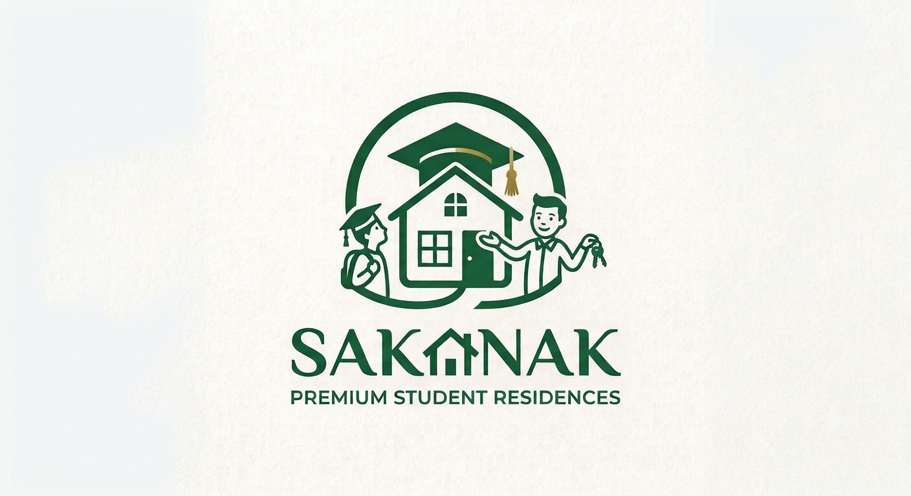

<div align="center">



# Sakanak — Premium Student Residences

**A full-stack platform connecting university students with verified landlords through smart roommate matching, digital contracts, and integrated payments.**

[](https://dotnet.microsoft.com/)
[](https://docs.microsoft.com/en-us/dotnet/csharp/)
[](https://www.microsoft.com/sql-server)
[](https://stripe.com)
[](https://tailwindcss.com/)

[🌐 Live Demo](http://sakanak.runasp.net) · [📋 Report a Bug](https://github.com/Arwa271102/DEPI-fProject/issues)

</div>

---

## 📖 Table of Contents

- [About The Project](#-about-the-project)
- [Key Features](#-key-features)
- [Tech Stack](#-tech-stack)
- [Architecture](#-architecture)
- [User Lifecycles](#-user-lifecycles)
  - [Authentication](#authentication)
  - [Student Lifecycle](#student-lifecycle)
  - [Landlord Lifecycle](#landlord-lifecycle)
  - [Admin Lifecycle](#admin-lifecycle)
- [Getting Started](#-getting-started)
- [Project Structure](#-project-structure)
- [Team](#-team)

---

## 🏠 About The Project

The student housing market is plagued by distrust, incompatible roommates, and cumbersome manual processes. **Sakanak** solves all of these with a single, elegant platform.

Landlords must pass a **mandatory verification gate** before listing any properties, giving students peace of mind. Students fill out a detailed **Lifestyle Questionnaire**, and the platform's matching algorithm calculates **compatibility scores** to predict how well they'll live with existing tenants. Once a student is accepted, the entire **contract and payment flow is automated** — no more chasing signatures or cash.

---

## ✨ Key Features

| Feature | Description |
|---|---|
| 🔐 **Dual Authentication** | Secure Email/Password + Google OAuth 2.0 sign-in |
| ✅ **Landlord Verification** | Admin-reviewed ID & document verification gate before listing |
| 🧠 **Smart Roommate Matching** | Lifestyle questionnaire + compatibility score algorithm |
| 🔍 **Advanced Search** | Filter by price, amenities, capacity, gender preferences, and location |
| 📄 **Automated Contracts** | Digital tenancy contracts generated upon booking approval |
| 💳 **Stripe Payments** | Secure, redirect-based online rental payments |
| 📧 **Transactional Emails** | SendGrid-powered email confirmations for every lifecycle event |
| 🔔 **Real-Time Notifications** | In-app notification system for booking/contract status updates |
| 💬 **In-App Messaging** | Direct messaging channel between students and landlords |
| 📊 **Admin Dashboard** | Full platform oversight: metrics, moderation, and dispute tools |

---

## 🛠 Tech Stack

### Backend
- **ASP.NET Core 8 MVC** — Primary web framework
- **C# 12** — Application language
- **Entity Framework Core** — ORM with Code-First migrations
- **ASP.NET Core Identity** — Authentication, roles, and user management
- **FluentValidation** — DTO-level input validation

### Frontend
- **Razor Pages** — Server-side HTML templating
- **Tailwind CSS** — Utility-first styling with a custom design system
- **Vanilla JavaScript** — Interactive UI (lightbox galleries, in-app modals, real-time counts)

### Database
- **Microsoft SQL Server** — Relational database
- **Hosted on:** MonsterASP.net (Production)

### External APIs
- **Stripe** — Payment processing (Checkout Sessions)
- **SendGrid** — Transactional email delivery
- **Google OAuth 2.0** — External authentication provider

---

## 🏗 Architecture

The project follows a **clean, layered N-tier architecture**:

```
┌─────────────────────────────────────┐
│         Sakanak.Web (MVC)           │  ← Controllers, Views, Layouts, Filters
├─────────────────────────────────────┤
│         Sakanak.BLL (Services)      │  ← Business Logic, DTOs, Interfaces, AutoMapper
├─────────────────────────────────────┤
│         Sakanak.DAL (Data)          │  ← EF Core DbContext, Repositories, UnitOfWork
├─────────────────────────────────────┤
│         Sakanak.Domain (Entities)   │  ← POCO Entities, Enums
└─────────────────────────────────────┘
```

**Pattern:** Repository + Unit of Work wrapping EF Core, accessed through typed Service interfaces in the BLL.

---

## 🔄 User Lifecycles

### Authentication
1. User registers via **Email** (requires email confirmation via SendGrid) or **Google OAuth**.
2. Role is selected (`Student` or `Landlord`) and stored in ASP.NET Identity.
3. Google OAuth users are intercepted by a **global action filter** (`RequireCompleteProfileAttribute`) and must complete platform-specific fields (Age, Phone, University) before accessing their dashboard.
4. The **Admin** account is seeded automatically on first startup via `IdentitySeedService`.

### Student Lifecycle
```
Register → Complete Profile → Fill Lifestyle Questionnaire
    → Search Apartments → View Compatibility Score
    → Send Booking Request → Wait for Landlord Response
    → Accept Contract → Pay via Stripe → Move In
```

### Landlord Lifecycle
```
Register → Upload Verification Documents → Wait for Admin Approval
    → Create Apartment Listing (with photos) → Receive Booking Requests
    → Review Student Profile & Lifestyle → Accept / Reject Applicant
    → Contract Auto-Generated → Await Student Payment
```

### Admin Lifecycle
```
Login (seeded account) → View Dashboard Metrics
    → Review Landlord Verification Queue (Approve / Reject)
    → Monitor All Requests & Contracts
    → Intervene / Cancel if needed
```

---

## 🚀 Getting Started

### Prerequisites
- [.NET 8 SDK](https://dotnet.microsoft.com/download/dotnet/8.0)
- [SQL Server](https://www.microsoft.com/sql-server) (LocalDB or Full)
- [Visual Studio 2022](https://visualstudio.microsoft.com/) or VS Code

### Installation

1. **Clone the repository:**
   ```bash
   git clone https://github.com/Arwa271102/DEPI-fProject.git
   cd DEPI-fProject
   ```

2. **Create `appsettings.json`** inside `Sakanak.Web/` (excluded from repo for security):
   ```json
   {
     "ConnectionStrings": {
       "DefaultConnection": "Server=.;Database=SakanakDB;Integrated Security=True;Encrypt=False;"
     },
     "IdentitySeed": {
       "AdminEmail": "admin@sakanak.local",
       "AdminPassword": "Admin@12345",
       "AdminName": "Platform Admin"
     },
     "SendGrid": {
       "ApiKey": "YOUR_SENDGRID_KEY",
       "FromEmail": "you@example.com",
       "FromName": "Sakanak Platform"
     },
     "Stripe": {
       "PublishableKey": "pk_test_YOUR_KEY",
       "SecretKey": "sk_test_YOUR_KEY",
       "Currency": "usd"
     },
     "Authentication": {
       "Google": {
         "ClientId": "YOUR_GOOGLE_CLIENT_ID",
         "ClientSecret": "YOUR_GOOGLE_CLIENT_SECRET"
       }
     }
   }
   ```

3. **Apply migrations** (the app auto-migrates on startup, or run manually):
   ```bash
   cd Sakanak.Web
   dotnet ef database update
   ```

4. **Run the project:**
   ```bash
   dotnet run
   ```
   The app will seed the Admin account automatically on first launch.

---

## 📁 Project Structure

```
Sakanak/
├── Sakanak.Domain/          # Entities, Enums (Student, Landlord, Apartment, Booking...)
├── Sakanak.DAL/             # DbContext, Migrations, Repositories, UnitOfWork
├── Sakanak.BLL/             # Services, DTOs, Interfaces, AutoMapper Profiles, Validators
└── Sakanak.Web/
    ├── Controllers/         # AdminController, StudentController, LandlordController...
    ├── Filters/             # RequireCompleteProfileAttribute (global filter)
    ├── Services/            # IdentitySeedService, BookingExpiryHostedService
    ├── Models/ViewModels/   # Strongly-typed ViewModels per controller
    ├── Views/
    │   ├── Admin/           # Dashboard, Verifications, Contracts, Requests...
    │   ├── Student/         # Search, Apartment Details, Bookings, Payments...
    │   ├── Landlord/        # Dashboard, Apartments, Requests, Bookings...
    │   ├── Account/         # Login, Register, ForgotPassword, CompleteProfile...
    │   └── Shared/          # Layouts (_TailwindAdminLayout, _TailwindStudentLayout...)
    └── wwwroot/             # Static assets, logo, uploads
```

---

## 👥 Team

| Name | Role |
|---|---|
| **Youssef Ayman** | Full-Stack Development & UI/UX Integration |
| **Abdelrahman Adel** | Backend Architecture & Database Design |
| **Arwa Mohamed** | API Integration (Stripe/SendGrid) & Testing |
| **Shahd Shaban** | System Analysis, Requirements & QA |

---

<div align="center">

**Built with ❤️ as a DEPI Final Project — 2025/2026**

*Sakanak — Elevating Student Living*

</div>